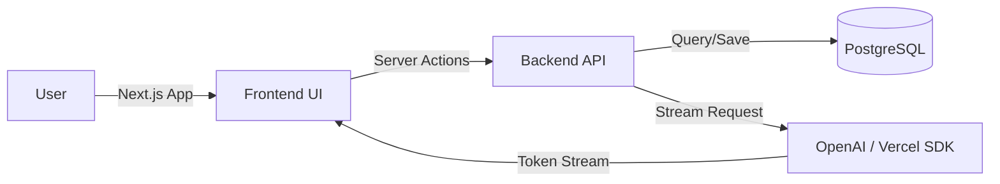

# 🤖 **QUBOT**

## AI Chat Assistant

**Presented by:** Amar Murmu
**Guide:** [Guide Name]

---

# 🎯 **The Problem**

- **Fragmentation**: Users switch between multiple apps for different AI models.
- **No Persistence**: Many free chat tools lose history on refresh.
- **Privacy Concerns**: Lack of secure authentication and private sessions.
- **Poor UX**: Clunky, slow interfaces that don't feel "modern".

---

# 💡 **The Solution: Qubot**

**Qubot** is next-gen AI chat platform that brings everything together.

- ✅ **Multi-Model Support**: Switch between AIs in one click.
- ✅ **Persistent Memory**: Your chats are saved safely in the cloud.
- ✅ **Secure**: Enterprise-grade GitHub OAuth authentication.
- ✅ **Fast**: Real-time streaming responses (Server-Sent Events).

---

# 🛠️ **Technology Stack**

_Built with the best modern web technologies._

- **Frontend**: Next.js 16 (React 19) ⚛️
- **Styling**: Tailwind CSS 4 + Radix UI 🎨
- **Backend**: Next.js Server Actions ⚡
- **Database**: PostgreSQL + Prisma ORM 🐘
- **Auth**: Better Auth (GitHub OAuth) 🔐
- **AI Engine**: Vercel AI SDK 🧠

---

# ✨ **Key Features**

1.  **Smart Chat Interface**  
    _Markdown support, code highlighting, and smooth streaming._

2.  **Organized History**  
    _Chats grouped by date, searchable, and manageable._

3.  **Responsive Design**  
    _Works perfectly on Desktop, Tablet, and Mobile (PWA)._

4.  **Dark Mode**  
    _A sleek, eye-friendly dark theme by default._

---

# 🏗️ **System Architecture**

_A simplified view of how data flows from you to the AI and back._

---

# 🔮 **Future Scope**

- 🎙️ **Voice Interaction**: Talk to Qubot directly.
- 📁 **File Uploads**: Analyze PDFs and Images.
- 👥 **Group Chats**: Collaborative AI sessions.
- 🔌 **Plugins**: Connect to external tools & APIs.

---

# 🏁 **Conclusion**

**Qubot** bridges the gap between powerful AI models and a usable, everyday interface. It demonstrates the power of modern web development in creating robust, scalable, and user-friendly applications.

---

# ❓ **Q & A**

### Thank You!
